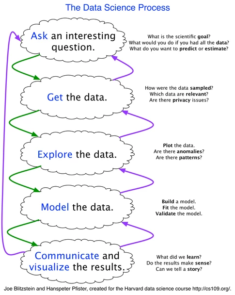

# Data Science Lab

Contents
------
* [Data Science Process](#Data-Science-Process)
* [Data Collection](#Data-Collection)
* [Pre-Processing](#Pre-Processing)
* [Model Evaluation](#Model-Evaluation)
* [Parameter Estimation](#Parameter-Estimation)
* [Machine Learning Algorithms](#Machine-Learning-Alogorithms)

# Data Science Process

 
 

# Data Collection

# Pre-Processing

# Model-Evaluation

# Parameter Estimation

# Machine Learning Alogorithms

    

    from IPython.core.display import HTML
    
    def css_styling():
        styles = open("./images/custom.css", "r").read()
        return HTML(styles)
    css_styling()

